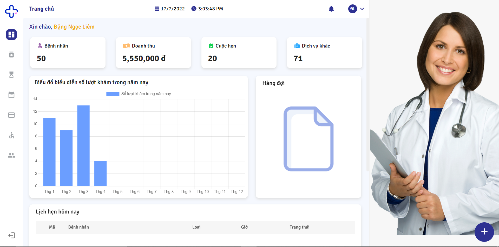
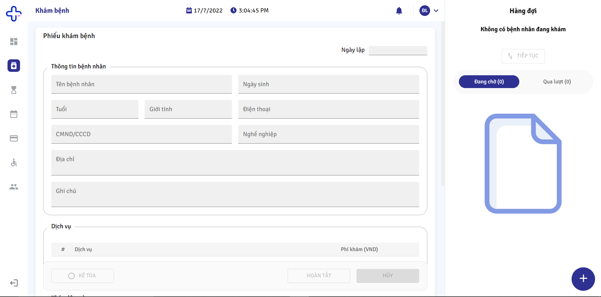
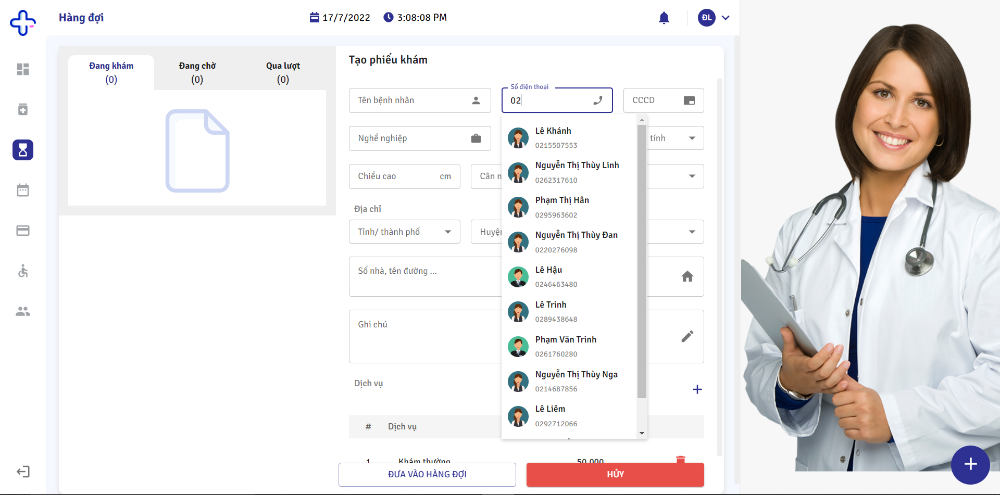
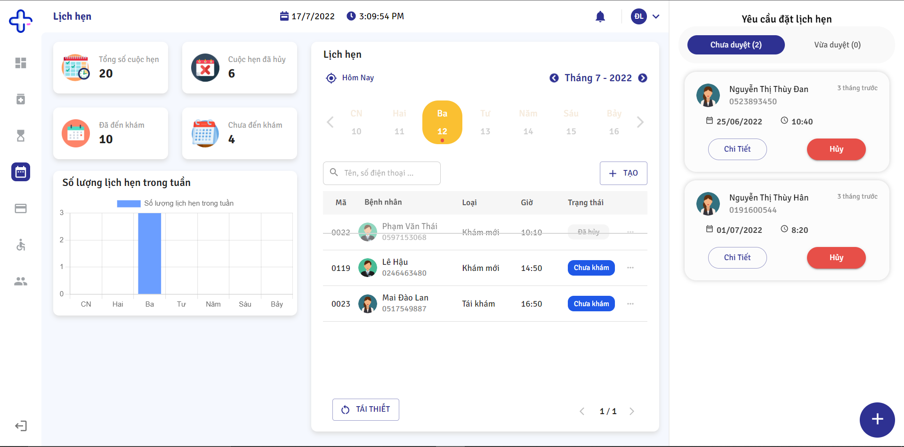
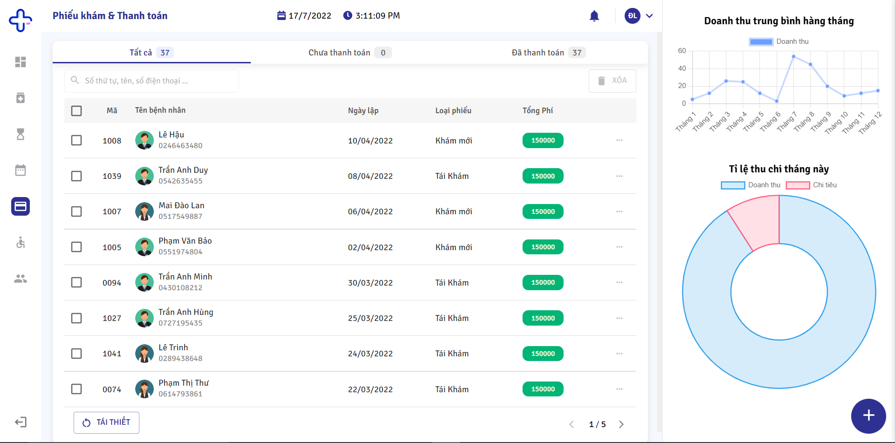
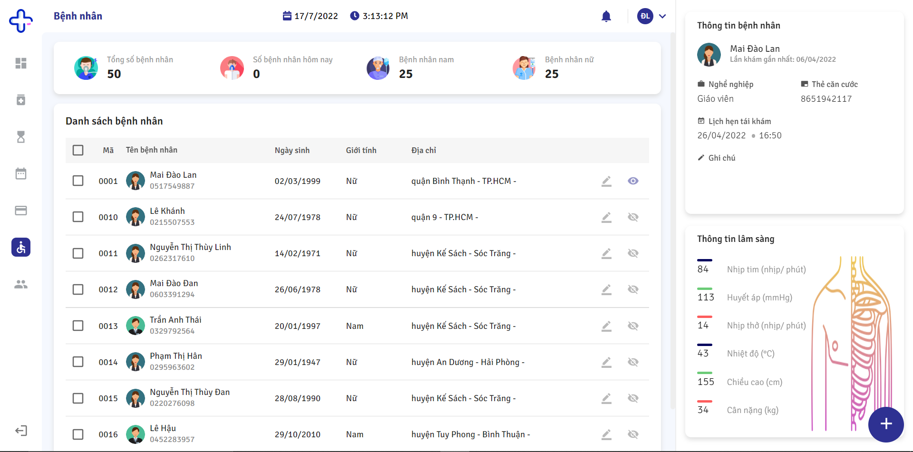

# CLINIC MANAGEMENT WEBSITE

-   [Demo](#demo)
-   [Technology](#technology)
-   [Features](#features)
-   [Screenshots](#screenshots-preview)

## Demo

-   Link: [https://clinic-management-website.vercel.app/](https://clinic-management-website.vercel.app/)
-   Account:
    -   Manager: manager@email.com / pw: manager123
    -   Doctor: doctor@email.com / pw: doctor123
    -   Receptionist: receptionist@email.com / pw: receptionist123

## Technology

-   ReactJs.
-   Material UI.
-   Redux-toolkit.
-   Formik, yup.
-   Firebase.

## Features

-   There are 3 roles including receptionist, doctor, and manager:
    -   Receptionist: Permission to manage appointments, patient queues, payment, and patient information.
    -   Doctor: Permission to see appointments, fill in medical tests, make prescriptions.
    -   Manager: All permissions of the other roles, in addition to managing employees.
-   Besides, clients can also make an appointment themselves.
-   Website uses real-time processing.

## Screenshots, Preview

-   **HOMEPAGE**
    
-   **MEDICAL EXAMINATION**
    
-   **QUEUE**
    
-   **APPOINTMENTS**
    
-   **INVOICES**
    
-   **PATIENTS**
    
